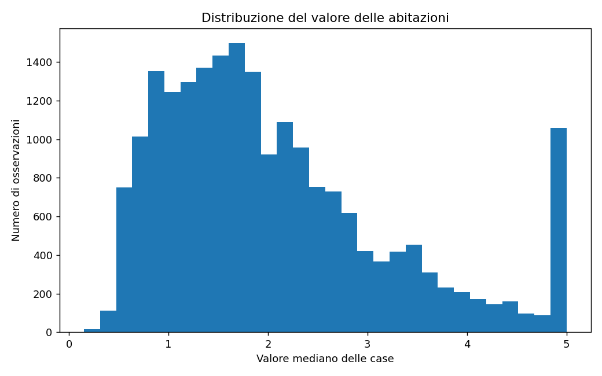
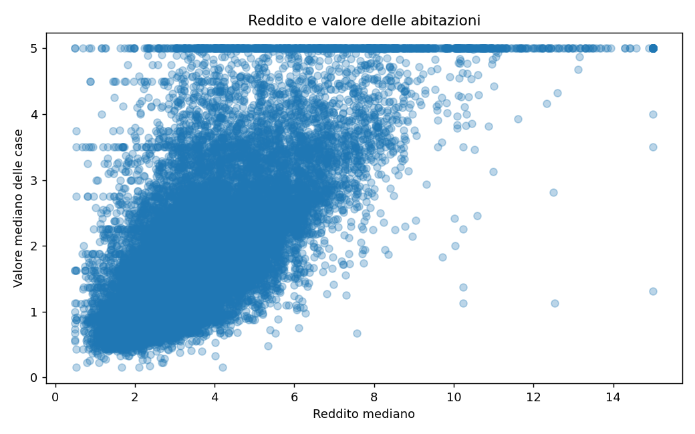
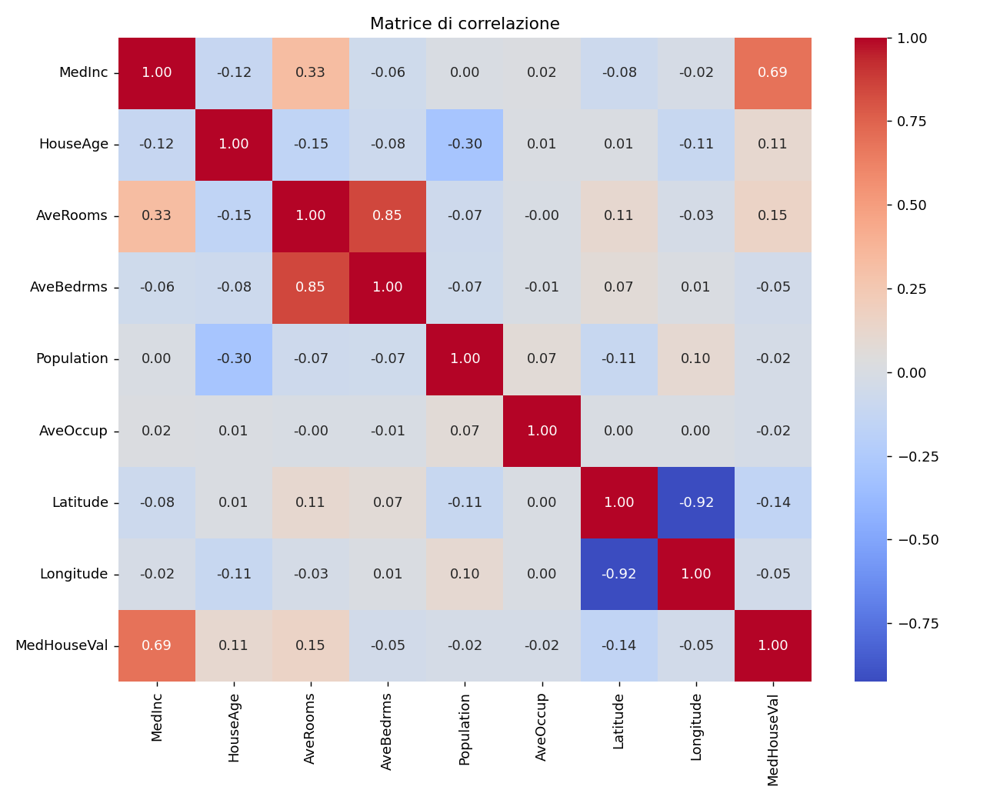
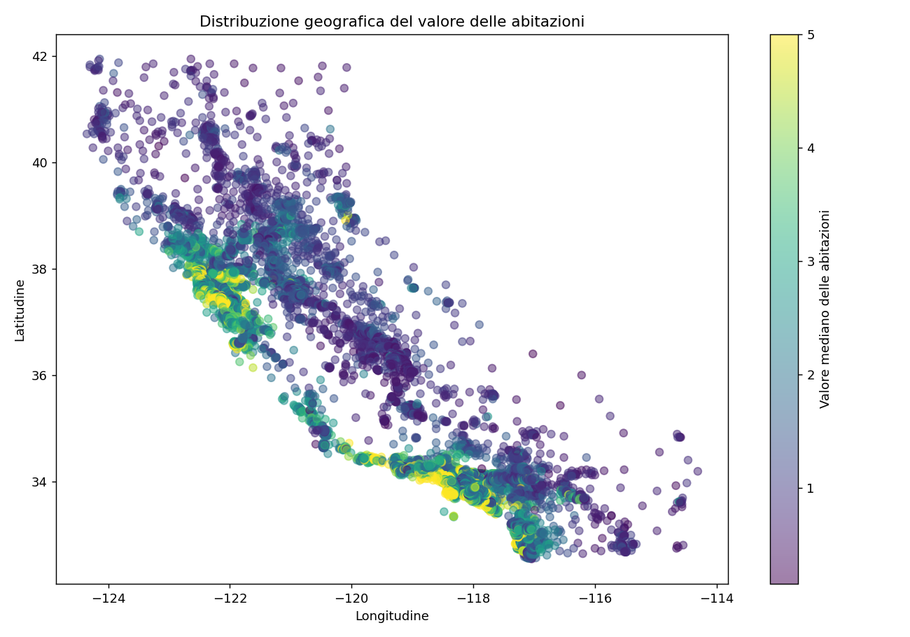
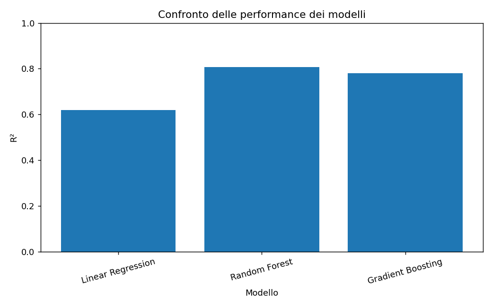
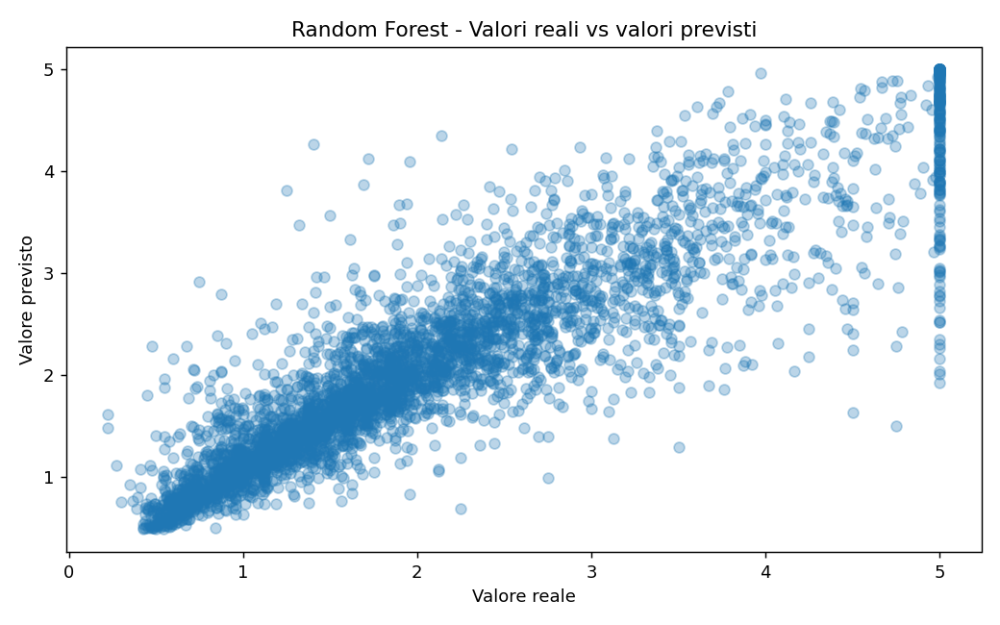

# California Housing Price Prediction


Machine Learning project focused on analyzing and predicting median house values using the California Housing dataset.

## Why this project

This project was built to practice the full ML workflow end-to-end rather than jumping straight to model fitting: exploring the data first, understanding *why* certain observations are anomalous before removing them, and comparing multiple model families instead of settling for the first one that runs. The California Housing dataset was chosen because it has real-world quirks — capped values, skewed features, geographic structure — that a fully synthetic or pre-cleaned dataset wouldn't surface.

## Project Overview

The goal of this project is to explore the dataset, identify relationships between variables, clean anomalous observations, and compare different Machine Learning models for predicting house values.

The project follows a complete Machine Learning workflow:
- Exploratory Data Analysis
- Data Cleaning
- Feature and Target preparation
- Train/Test split
- Model training
- Model evaluation
- Feature importance analysis
- Model comparison

## Dataset

The dataset contains information about California housing districts. Each observation represents a census block group rather than an individual house.

Main features:

| Feature     | Description                   |
| ----------- | ------------------------------ |
| MedInc      | Median income                 |
| HouseAge    | Median house age              |
| AveRooms    | Average number of rooms       |
| AveBedrms   | Average number of bedrooms    |
| Population  | Population of the block group |
| AveOccup    | Average household occupancy   |
| Latitude    | Geographic latitude           |
| Longitude   | Geographic longitude          |
| MedHouseVal | Median house value            |

The target variable is `MedHouseVal`, expressed in units of $100,000.

## Exploratory Data Analysis

The analysis focused on:
- Dataset structure and dimensions
- Descriptive statistics
- Missing values
- Duplicate observations
- Target distribution
- Relationship between income and house value
- Correlation between numerical variables
- Geographic distribution of house values

### Target distribution



The distribution is right-skewed, with a clear spike at the value 5.0. This is not a natural data pattern — it's a **top-coding artifact**: the original survey capped median house values at $500,000, so every district above that threshold was recorded as exactly 5.0. This is worth flagging explicitly, since it can bias model errors on the highest-value districts.

### Income vs. house value



One of the strongest relationships identified was between median income (`MedInc`) and median house value (`MedHouseVal`). The same capping effect is visible here too: `MedInc` appears to be truncated at 15.

### Correlation matrix



Geographic variables also showed meaningful relationships with house values, and `Latitude`/`Longitude` are themselves strongly (negatively) correlated with each other, which reflects California's coastline geography rather than a data issue.

### Geographic distribution



Plotting price by coordinates traces out the shape of California itself, with the highest-value districts (yellow) clustered tightly around the San Francisco Bay Area and the Los Angeles/coastal Southern California corridor — a strong visual confirmation that location drives price independently of income.

## Data Cleaning

The dataset was checked for missing values, duplicate rows, and extreme observations.

A small number of extremely anomalous observations were identified in `AveOccup`. Observations with `AveOccup > 50` were removed. Only 7 observations were removed from the original 20,640 rows.

The cleaned dataset was saved as `housing_clean.csv`.

## Machine Learning

Three regression models were trained and evaluated:
1. Linear Regression
2. Random Forest Regressor (`n_estimators=100`)
3. Gradient Boosting Regressor (`n_estimators=100`)

The dataset was split into 80% training data and 20% test data, with `random_state=42` for reproducibility.

Model hyperparameters were left at their scikit-learn defaults (aside from `n_estimators=100`) — no hyperparameter tuning (e.g. grid search) or cross-validation was performed. This is a natural next step; see [Future Improvements](#future-improvements).

## Model Results

| Model             | MAE    | RMSE   | R²     |
| ----------------- | ------ | ------ | ------ |
| Linear Regression | 0.5096 | 0.7137 | 0.6180 |
| Random Forest     | 0.3296 | 0.5073 | 0.8070 |
| Gradient Boosting | 0.3728 | 0.5409 | 0.7806 |



The Random Forest achieved the best overall performance.

### Best Model: Random Forest

- **MAE:** 0.3296
- **RMSE:** 0.5073
- **R²:** 0.8070

Since the target is expressed in units of $100,000, the MAE corresponds to an average absolute error of approximately **$33,000**. The model explains approximately **80.7% of the variance** in the target variable on the test set.



The predicted-vs-actual plot shows the fit is tight for mid-range values, but the model systematically underpredicts the capped top-coded observations (the horizontal band at the top) — a direct consequence of the top-coding artifact noted in the EDA section.

## Feature Importance

The Random Forest identified `MedInc` as the most important feature.

| Feature   | Importance |
| --------- | ---------- |
| MedInc    | 0.5204     |
| AveOccup  | 0.1385     |
| Longitude | 0.0918     |
| Latitude  | 0.0914     |
| HouseAge  | 0.0542     |

Feature importance represents the contribution of each feature to the model's predictions. It should not be interpreted as proof of causation.

## Technologies

- Python
- Pandas
- NumPy
- Matplotlib
- Seaborn
- Scikit-learn

## Project Structure

```
california-housing-price-prediction/
│
├── images/
│   ├── 01_distribuzione_valore.png
│   ├── 02_reddito_vs_valore.png
│   ├── 03_matrice_correlazione.png
│   ├── 04_distribuzione_geografica.png
│   ├── 05_confronto_modelli.png
│   └── 06_reale_vs_previsto.png
├── analisi.py
├── housing.csv
├── housing_clean.csv
├── requirements.txt
└── README.md
```

## How to Run

Install the required libraries:
```bash
pip install -r requirements.txt
```

Then run:
```bash
python3 analisi.py
```

The script performs the complete analysis, cleaning process, model training and evaluation, and displays each chart interactively as it runs.

## Conclusions

The analysis shows that non-linear ensemble models significantly outperform the Linear Regression baseline on this dataset. Among the tested models, Random Forest achieved the best performance, with an R² of approximately 0.81.

The EDA also surfaced a top-coding artifact in the target variable (and in `MedInc`) that directly explains part of the residual error in the ML models — a reminder that understanding *why* a dataset behaves the way it does is as important as the modeling itself.

The project demonstrates a complete introductory Machine Learning pipeline, from raw data exploration and cleaning to model comparison and interpretation.

## Future Improvements

- Hyperparameter tuning (GridSearchCV / RandomizedSearchCV)
- k-fold cross-validation instead of a single train/test split
- Handling the top-coded target explicitly (e.g. excluding or flagging capped observations)
- Additional models (XGBoost, LightGBM)
- A Jupyter notebook version for a more readable, cell-by-cell walkthrough
- Deployment as a simple API or web demo

## Author

**Antonio Monaco**
Computer Engineering student at Politecnico di Milano.
Interested in Data Engineering, Machine Learning, and scalable data systems.

GitHub: [antonioMonaco99](https://github.com/antonioMonaco99)

The analysis shows that non-linear ensemble models significantly outperform the Linear Regression baseline on this dataset.

Among the tested models, Random Forest achieved the best performance, with an R² of approximately 0.81.

The project demonstrates a complete introductory Machine Learning pipeline, from raw data exploration and cleaning to model comparison and interpretation.
